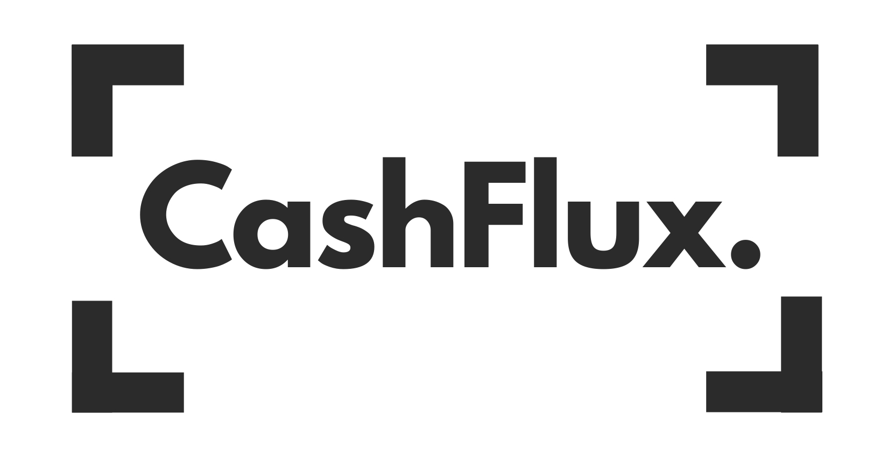

<p align="center">
  
</p>

# CashFlux

AI-powered expense intelligence and automated fraud detection platform for small to medium-sized businesses.

Built by Team J2E2 (Jongmin Lee, Juan Felipe Duran, Elsa Zhang, and Édouard Chassé) in 24 hours for MPC Hacks 2026, a major hackathon organized by students from McGill University, Polytechnique Montréal, and Concordia University.

This project won **2nd Place for the Brim Financial Sponsor Track** and **Best Use of ElevenLabs** from MLH, earning over $750 in prizes. Check out the original [Devpost submission](https://devpost.com/software/mpc-hacks-2026).

## Features

- **Receipt OCR:** Reads receipts directly from images using Gemini 2.5 Flash. Flags personal items, checks tip limits, and reconciles totals against card transactions.
- **Fraud scoring:** Evaluates transactions against a statistical baseline. Analyzes spending velocity, peer benchmarks, and historical patterns to assign risk scores and flag anomalies.
- **Policy enforcement:** Parses human-readable corporate spending policies into strict rules and enforces them against transactions in real-time.
- **Voice assistant:** An always-on assistant powered by Gemini 2.5 Flash, Whisper, and ElevenLabs TTS. Navigates the dashboard, queries spend data, and executes approvals via voice.
- **Pre-approval workflows:** Allows employees to submit budget proposals and routes them to managers with context and recommendations.

## Setup

Python 3.12+ is required. A virtual environment is recommended.

1. Clone the repository:

   ```bash
   git clone https://github.com/DoudGeorges/cashflux.git
   cd cashflux
   ```

2. Install dependencies:

   ```bash
   uv pip install -r requirements.txt
   ```

3. Configure environment variables:
   Copy `.env.example` to `.env` and configure your API keys.

## Usage

Start the Flask development server:

```bash
python app.py
```

Navigate to `http://127.0.0.1:5000` and create a new account. To explore the pre-populated hackathon data, set your company name to **Northwind Analytics**.

## Testing

Run the fraud detection unit tests:

```bash
python -m unittest tests.test_fraud_detector -v
```

## License

MIT
